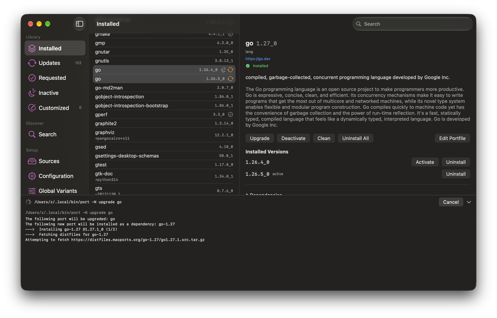

# Ports

A macOS app for MacPorts.



Installed ports, available updates, search, `macports.conf` and `sources.conf`
editing, and Portfile patching. Port operations stream their output in a console
at the bottom of the window.

## Build

```
./bundle.sh
```

Produces `Ports.app`. Pass `release` for a hardened runtime build, with
`CODESIGN_IDENTITY` and `NOTARY_PROFILE` set to sign and notarize.

## Portfile patching

"Edit Portfile" copies a port into a local tree listed above the default source
in `sources.conf`, keeps the upstream copy as a diff baseline, and reindexes on
save so `port` uses the patched version.
